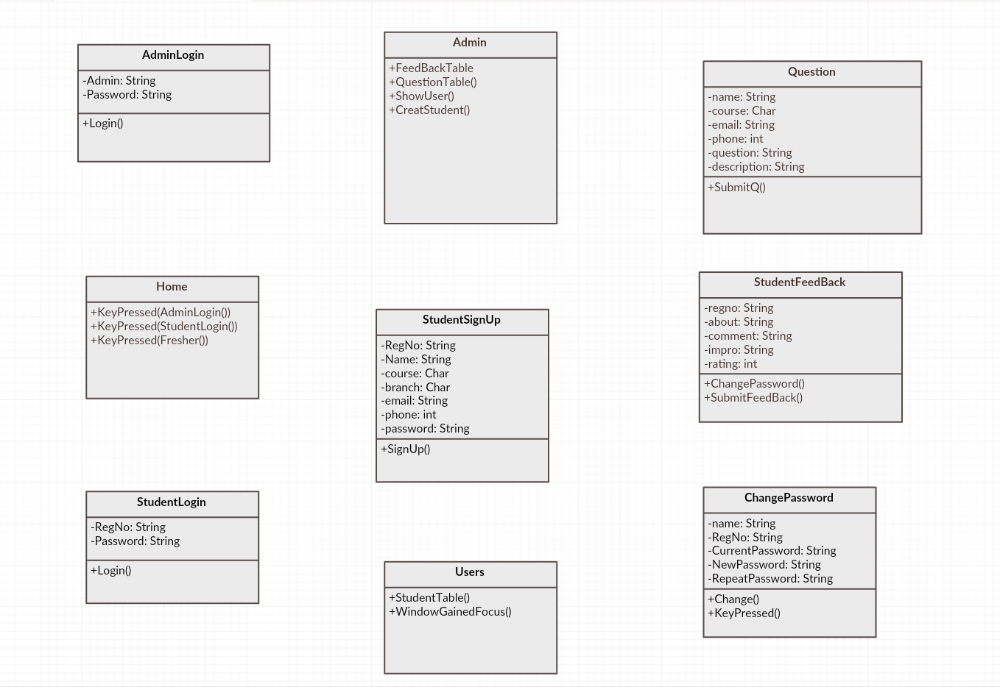
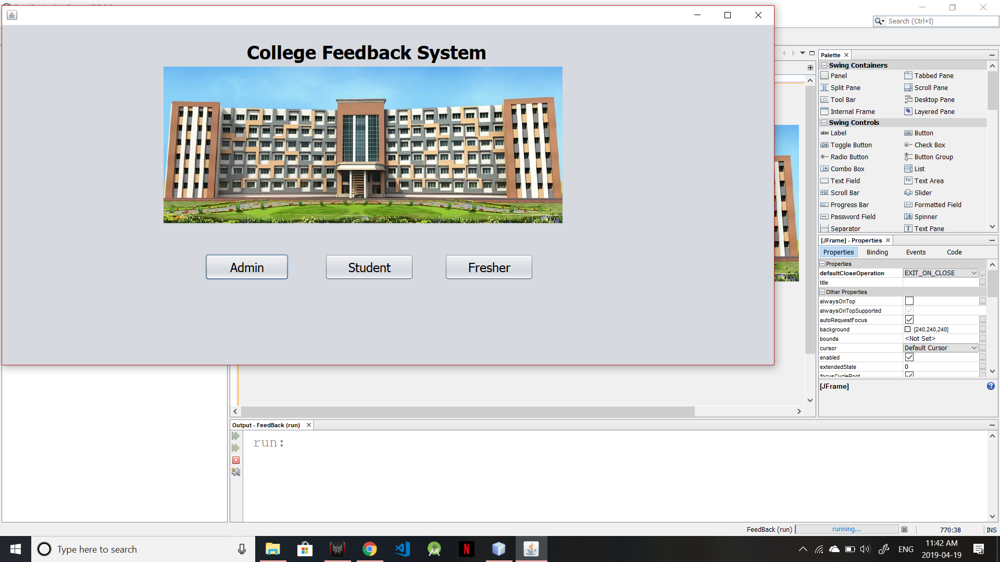
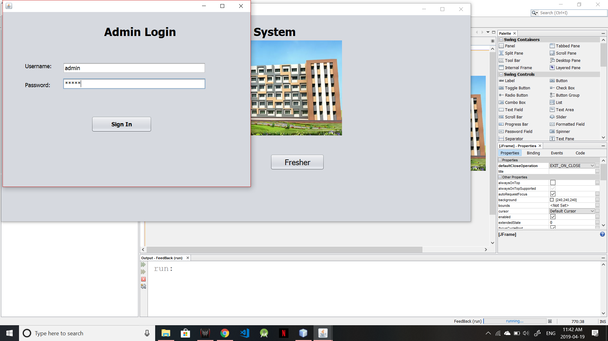
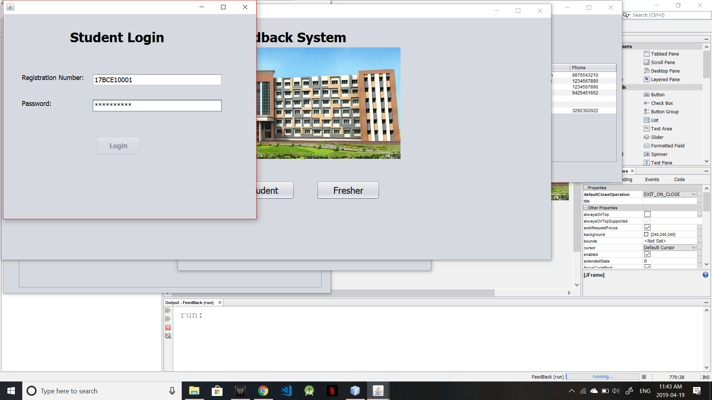
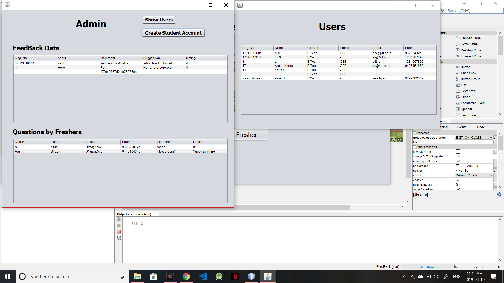
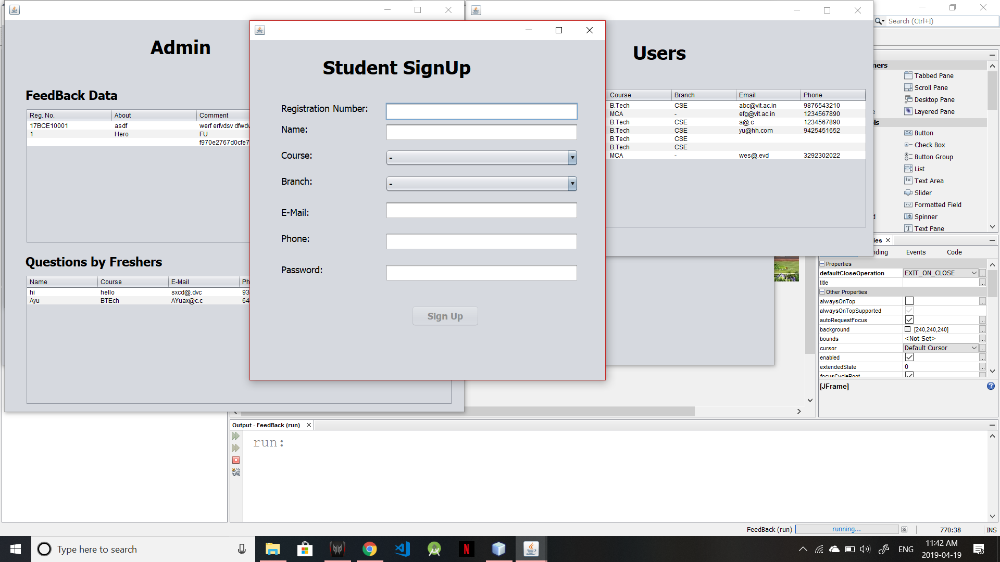
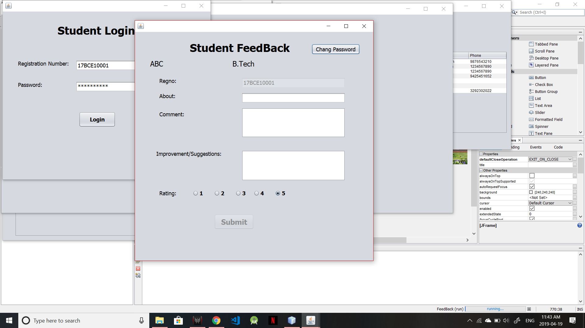
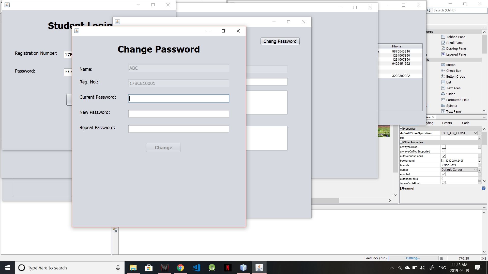

# FeedBack-System
A Java NetBeans project developed for taking university feedbacks and querries. Project allows university students to share their experiences and feedbacks about university so that freshers can seek and learn from the shared experience. Admin has access to all the feedback, and is only user to create student profile. As the project is still incomplete there is a great scope of new functionalities like upvotes,comments etc to a feedback, similarly "+1" for existing querries. 

## Project Design

## Setup
* Clone/Download the whole project and open it using NetBeans.
* To set up database modules, create table in MySQL.
* Now you can either make changes or run the project as it is.

## Screenshots of Program
* **Main Page**

---

* **Login**

Admin Login | Student Login
--- | ---
 | 
---

* **Admin Dashboard**

---

* **Add Student**

---

* **Student Feedback**

---

* **Change Password**

